# MTA for Java Workshop 

Docker EE 2.0 is the first Containers-as-a-Service platform to offer production-level support for the integrated management and security of both Linux and Windows Server Containers. It is also the first platform to support both Docker Swarm and Kubernetes orchestration.

In this lab we'll use a Docker EE cluster. We'll initially deploy both a Java n-tier web app and modernize it into multi-service application using Docker Swarm. Then we'll take a look at securing and scaling the application. Finally, we will then deploy the app using Kubernetes.

> **Difficulty**: Intermediate (assumes basic familiarity with Docker) If you're looking for a basic introduction to Docker, check out [https://training.play-with-docker.com](https://training.play-with-docker.com)

> **Time**: Approximately 75 minutes

> **Introduction**:
>	* [What is the Docker Platform](#intro1)
>	* [Overview of Orchestration](#intro2)
>		* [Basics of Docker Swarm mode](#intro2.1)
>		* [Basics of Kubernetes](#intro2.2)

> **Tasks**:

> * [Task 1: Configure the Docker EE Cluster](#task1)
>   * [Task 1.1: Accessing PWD](#task1.1)
>   * [Task 1.2: Install a Windows worker node](#task1.2)
>   * [Task 1.3: Create Five Repositories](#task1.3)
> * [Task 2: Deploy a Java Web App with Universal Control Plane](#task2)
>   * [Task 2.1: Clone the Demo Repo](#task2.1)
>   * [Task 2.2: Building the Web App and Database Images](#task2.2)
>   * [Task 2.3: Building and Pushing the Application to DTR](#task2.3)
>   * [Task 2.4: Deploy the Web App using UCP](#task2.4)
> * [Task 3: Modernizing with Microservices](#task3)
>   * [Task 3.1: Building the Microservices Images](#task3.1)
>   * [Task 3.2: Push to DTR](#task3.2)
>   * [Task 3.3: Run the Application in UPC](#task3.3)
> * [Task 4: Iterating on the Client](#task4)
>   * [Task 4.1: Building the Javascript Client](#task4.1)
>   * [Task 4.2: Deploying on a Running Cluster](#task4.2)
> * [Task 5: Adding Logging and Monitoring](#task5)
>   * [Task 5.1: Add Data](#task5.1)
>   * [Task 5.2: Display Data on Kibana](#task5.2)
> * [Task 6: Deploying on Kubernetes (#task6)]

## Understanding the Play With Docker Interface


This workshop is only available to people in a pre-arranged workshop. That may happen through a [Docker Meetup](https://events.docker.com/chapters/), a conference workshop that is being led by someone who has made these arrangements, or special arrangements between Docker and your company. The workshop leader will provide you with the URL to a workshop environment that includes [Docker Enterprise Edition](https://www.docker.com/enterprise-edition). The environment will be based on [Play with Docker](https://labs.play-with-docker.com/).

If none of these apply to you, contact your local [Docker Meetup Chapter](https://events.docker.com/chapters/) and ask if there are any scheduled workshops. In the meantime, you may be interested in the labs available through the [Play with Docker Classroom](training.play-with-docker.com).

There are three main components to the Play With Docker (PWD) interface. 

### 1. Console Access
Play with Docker provides access to the 3 Docker EE hosts in your Cluster. These machines are:

* A Linux-based Docker EE 18.01 Manager node
* Three Linux-based Docker EE 18.01 Worker nodes

> **Important Note: beta** Please note, as of now this is a Docker EE 2.0 environment. Docker EE 2.0 shows off the new Kubernetes functionality which is described below.

By clicking a name on the left, the console window will be connected to that node.

### 2. Access to your Universal Control Plane (UCP) and Docker Trusted Registry (DTR) servers

Additionally, the PWD screen provides you with a one-click access to the Universal Control Plane (UCP)
web-based management interface as well as the Docker Trusted Registry (DTR) web-based management interface. Clicking on either the `UCP` or `DTR` button will bring up the respective server web interface in a new tab.

### 3. Session Information

Throughout the lab you will be asked to provide either hostnames or login credentials that are unique to your environment. These are displayed for you at the bottom of the screen.

## Document conventions

- When you encounter a phrase in between `<` and `>`  you are meant to substitute in a different value.

	For instance if you see `<dtr hostname>` you would actually type something like `ip172-18-0-7-b70lttfic4qg008cvm90.direct.ee-workshop.play-with-docker.com`

## <a name="intro1"></a>Introduction

Docker EE provides an integrated, tested and certified platform for apps running on enterprise Linux or Windows operating systems and Cloud providers. Docker EE is tightly integrated to the the underlying infrastructure to provide a native, easy to install experience and an optimized Docker environment. Docker Certified Infrastructure, Containers and Plugins are exclusively available for Docker EE with cooperative support from Docker and the Certified Technology Partner.

### <a name="intro2"></a>Overview of Orchestration

While it is easy to run an application in isolation on a single machine, orchestration allows you to coordinate multiple machines to manage an application, with features like replication, encryption, loadbalancing, service discovery and more. If you've read anything about Docker, you have probably heard of Kubernetes and Docker swarm mode. Docker EE allows you to use either Docker swarm mode or Kubernetes for orchestration. 

Both Docker swarm mode and Kubernetes are declarative: you declare your cluster's desired state, and applications you want to run and where, networks, and resources they can use. Docker EE simplifies this by taking common concepts and moving them to the a shared resource.

#### <a name="intro2.1"></a>Overview of Docker Swarm mode

A swarm is a group of machines that are running Docker and joined into a cluster. After that has happened, you continue to run the Docker commands you’re used to, but now they are executed on a cluster by a swarm manager. The machines in a swarm can be physical or virtual. After joining a swarm, they are referred to as nodes.

Swarm mode uses managers and workers to run your applications. Managers run the swarm cluster, making sure nodes can communicate with each other, allocate applications to different nodes, and handle a variety of other tasks in the cluster. Workers are there to provide extra capacity to your applications. In this workshop, you have one manager and three workers.

#### <a name="intro2.2"></a>Overview of Kubernetes

Kubernetes is available in Docker EE 2.0 and included in this workshop. Kubernetes deployments tend to be more complex than Docker Swarm, and there are many component types. UCP simplifies a lot of that, relying on Docker Swarm to handle shared resources. We'll concentrate on Pods and Load Balancers in this workshop, but there's plenty more supported by UCP 2.0.

## <a name="task1"></a>Task 1: Configure the Docker EE Cluster

The Play with Docker (PWD) environment is almost completely set up, but before we can begin the labs, we need to do two more steps. First we'll create two repositories in Docker Trusted Registry.

### <a name="task 1.1"></a>Task 1.1: Accessing PWD

1. Navigate in your web browser to the URL the workshop organizer provided to you.

2. Fill out the form, and click `submit`. You will then be redirected to the PWD environment.

	It may take a few minutes to provision out your PWD environment. After this step completes, you'll be ready to move on to task 1.2: Install a Windows worker node

	> In a production environment you would use certs from a trusted certificate authority and would not see this screen.
	>
	> 

2. When prompted enter your username and password (these can be found below the console window in the main PWD screen). The UCP web interface should load up in your web browser.

	> **Note**: Once the main UCP screen loads you'll notice there is a red warning bar displayed at the top of the UCP screen, this is an artifact of running in a lab environment. A UCP server configured for a production environment would not display this warning
	>
	> 


### <a name="task1.3"></a>Task 1.3: Create Five DTR Repositories

Docker Trusted Registry is a special server designed to store and manage your Docker images. In this lab we're going to create five different Docker images, and push them to DTR. But before we can do that, we need to setup repositories in which those images will reside. Often that would be enough.

However, before we create the repositories, we do want to restrict access to them. Since we have two distinct app components, a front end Java web app, and a set of back end services, we want to restrict access to them to the team that develops them, as well as the administrators. To do that, we need to create two users and then two organizations.

1. In the PWD web interface click the `DTR` button on the left side of the screen.

	> **Note**: As with UCP before, DTR is also using self-signed certs. It's safe to click through any browser warning you might encounter.

2. From the main DTR page, click users and then the New User button.

	

3. Create a new user, `frontend_user` and give it a password you'll remember. I used `user1234`. Be sure to save the user.

	

	Then do the same for a `backend_user`.

4. Select the Organization button.

	

5. Press New organization button, name it `frontend`, and click save.

	

	Then do the same with `backend` and you'll have two organizations.

	

6. Now you get to add a repository! Click on the `frontend` organization, select repositories and then Add repository

	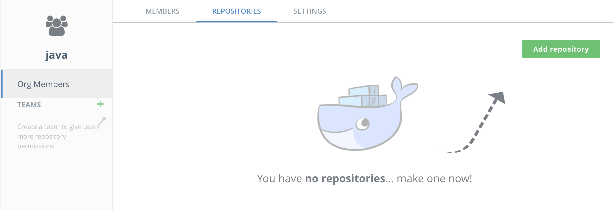

7. Name the repository `java_web`.

	

	> Note the repository is listed as "Public" but that means it is publicly viewable by users of DTR. It is not available to the general public.

8. Now it's time to create a team so you can restrict access to who administers the images. Select the `frontend` organization and the members will show up. Press Add user and start typing in frontend. Select the `frontend_user` when it comes up.

	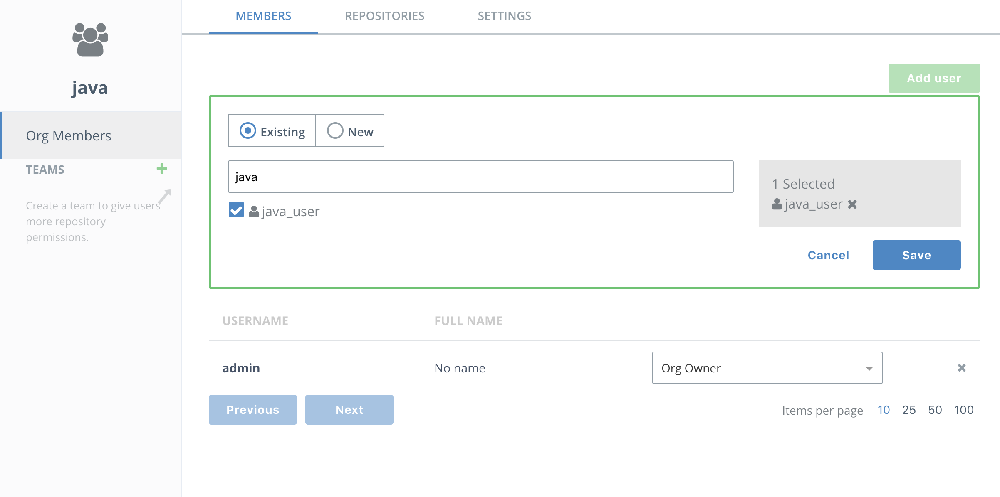

9. Next select the `frontend` organization and press the `Team` button to create a `web` team.

	

10. Add the `frontend_user` user to the `web` team and click save.

	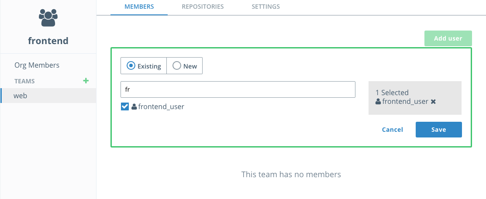

	

11. Next select the `web` team and select the `Repositories` tab. Select `Add Existing repository` and choose the `java_web`repository. You'll see the `java` account is already selected. Then select `Read/Write` permissions so the `web` team has permissions to push images to this repository. Finally click `save`.

	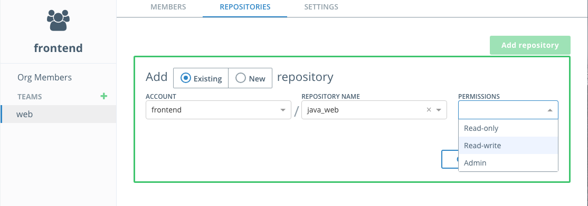

12. Now add a new repository also owned by the web team and call it `signup_client`. This can be done directly from the web team's `Repositories` tab by selecting the radio button for Add `New` Repository. Be sure to grant `Read/Write` permissions for this repository to the `web` team as well.

	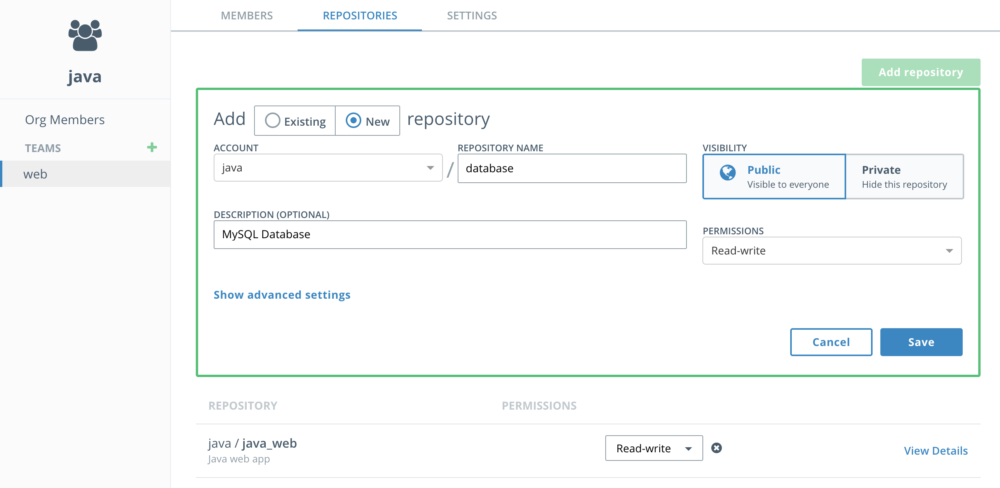

13. Repeat 4-11 above to create a `backend` organization with repositories called `database`, `messageservice` and `worker`. Create a team named `services` (with `backend_user` as a member). Grant `read/write` permissions for the `database`,`messageservice` and `worker` repositories to the `services` team.

14. From the main DTR page, click Repositories, you will now see all three repositories listed.
	
	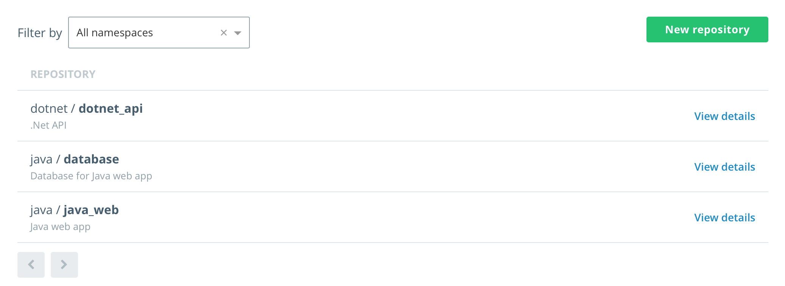

15. (optional) If you want to check out security scanning in Task 5, you should turn on scanning now so DTR downloads the database of security vulnerabilities. In the left-hand panel, select `System` and then the `Security` tab. Select `ENABLE SCANNING` and `Online`.

	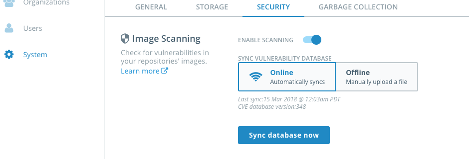

Congratulations, you have created five new repositories in two new organizations, each with one team and a user each.

## <a name="task2"></a>Task 2: Deploy a Java Web App with Universal Control Plane
Now that we've completely configured our cluster, let's deploy a couple of web apps. The first app is a basic Java CRUD (Create Read Update Delete) application in Tomcat that writes to a MySQL database.

### <a name="task2.1"></a> Task 2.1: Clone the Demo Repo

1. From PWD click on the `worker1` link on the left to connnect your web console to the UCP Linux worker node.

2. Before we do anything, let's configure an environment variable for the DTR URL/DTR hostname. You may remember that the session information from the Play with Docker landing page. Select and copy the the URL for the DTR hostname.

	

3. Set an environment variable `DTR_HOST` using the DTR host name defined on your Play with Docker landing page:

	```bash
	$ export DTR_HOST=<dtr hostname>
	$ echo $DTR_HOST
	```

4. Now use git to clone the workshop repository.

	```bash
	$ git clone https://github.com/dockersamples/mta_java_workshop.git
	```

	You should see something like this as the output:

	```bash
	Cloning into 'mta_java_workshop'...
	remote: Counting objects: 389, done.
	remote: Compressing objects: 100% (17/17), done.
	remote: Total 389 (delta 4), reused 16 (delta 1), pack-reused 363
	Receiving objects: 100% (389/389), 13.74 MiB | 3.16 MiB/s, done.
	Resolving deltas: 100% (124/124), done.
	Checking connectivity... done.
	```

	You now have the necessary demo code on your worker host.

### <a name="task2.2"></a> Task 2.2: Building the Web App and Database Images

As a first step, containerizing the application without changing existing code let's us test the concept of migrating the application to a container architecture. I'll do this by building the application from the source code and deploying it in an application server.  The code for containerizing the application can be found in the [part_2](./part_2) directory. Additionally, I'll configure and deploy the database.

Docker makes this possible with a Dockerfile, which is a text document that contains all the commands a user could call on the command line to assemble an image. Using docker build users can create an automated build that executes several command-line instructions in succession.

Within a Dockerfile, I'll perform a multi-stage where the code will be compiled and packaged using a container running maven.  All dependencies and jar files are downloaded to the maven container based on the pom.xml file. The toolchain to build the application is completely in the maven container and not local to your development environment. All builds will be exactly the same regardless of the development environment.

```
FROM maven:latest AS devenv
WORKDIR /usr/src/signup 
COPY app/pom.xml .
RUN mvn -B -f pom.xml -s /usr/share/maven/ref/settings-docker.xml dependency:resolve
COPY ./app .
RUN mvn -B -s /usr/share/maven/ref/settings-docker.xml package -DskipTests
```

The second part of the multi-stage build deploys the application in a Java application server. I'm using Tomcat in this tutorial but the process is the same for any other application service. This part of the build configures Tomcat by adding custom configuration files, copying needed jars such as the MySQL JDBC connector, and the application packaged as a WAR file.

```
FROM tomcat:7-jre8
LABEL maintainer="Sophia Parafina <sophia.parafina@docker.com>"

# tomcat-users.xml sets up user accounts for the Tomcat manager GUI
ADD tomcat/tomcat-users.xml $CATALINA_HOME/conf/

# ADD tomcat/catalina.sh $CATALINA_HOME/bin/
ADD tomcat/run.sh $CATALINA_HOME/bin/run.sh
RUN chmod +x $CATALINA_HOME/bin/run.sh

# add MySQL JDBC driver jar
ADD tomcat/mysql-connector-java-5.1.36-bin.jar $CATALINA_HOME/lib/

# create mount point for volume with application
WORKDIR $CATALINA_HOME/webapps/
COPY --from=devenv /usr/src/signup/target/Signup.war .

# start tomcat7 with remote debugging
EXPOSE 8080
CMD ["run.sh"]
```

Building the database container follows a similar patter, including creating the database schema.

```
FROM mysql:latest

# Contents of /docker-entrypoint-initdb.d are run on mysqld startup
ADD  docker-entrypoint-initdb.d/ /docker-entrypoint-initdb.d/

# Default values for passwords and database name. Can be overridden on docker run
ENV MYSQL_DATABASE=signup
ENV MYSQL_USER=gordon
ENV MYSQL_PASSWORD=password
```

### <a name="task2.3"></a> Task 2.3: Building and Pushing the Application to DTR

1. Change into the `java-app` directory.

	```bash
	$ cd ./part_2/appserver/
	```

2. Use `docker build` to build your Docker image.

	```Bash
	$ docker build -t $DTR_HOST/frontend/java_web .
	```

	The `-t` tags the image with a name. In our case, the name indicates which DTR server and under which organization's respository the image will live.

	> **Note**: Feel free to examine the Dockerfile in this directory if you'd like to see how the image is being built.

	There will be quite a bit of output. The Dockerfile describes a two-stage build. In the first stage, a Maven base image is used to build the Java app. But to run the app you don't need Maven or any of the JDK stuff that comes with it. So the second stage takes the output of the first stage and puts it in a much smaller Tomcat image.

3. Log into your DTR server from the command line.
 
	First use the `backend_user`, which isn't part of the java organization

	```bash
	$ docker login $DTR_HOST
	Username: <your username>
	Password: <your password>
	Login Succeeded
	```
	
	Use `docker push` to upload your image up to Docker Trusted Registry.
	
	```bash
	$ docker push $DTR_HOST/frontend/java_web
	```
	
	> TODO: add output of failure to push

	```bash
	$ docker push $DTR_HOST/frontend/java_web
	The push refers to a repository [.<dtr hostname>/frontend/java_web]
	8cb6044fd4d7: Preparing
	07344436fe27: Preparing
	...
	e1df5dc88d2c: Waiting
	denied: requested access to the resource is denied
	```

	As you can see, the access control that you established in the [Task 1.3](#task1.3) prevented you from pushing to this repository.	

4. Now try logging in using `frontend_user`, and then use `docker push` to upload your image up to Docker Trusted Registry.

	```bash
	$ docker push $DTR_HOST/frontend/java_web
	```

	The output should be similar to the following:

	```bash
	The push refers to a repository [<dtr hostname>/java/java_web]
	feecabd76a78: Pushed
	3c749ee6d1f5: Pushed
	af5bd3938f60: Pushed
	29f11c413898: Pushed
	eb78099fbf7f: Pushed
	latest: digest: sha256:9a376fd268d24007dd35bedc709b688f373f4e07af8b44dba5f1f009a7d70067 size: 1363
	```

	Success! Because you are using a user name that belongs to the right team in the right organization, you can push your image to DTR.

5. In your web browser head back to your DTR server and click `View Details` next to your `java_web` repo to see the details of the repo.

	> **Note**: If you've closed the tab with your DTR server, just click the `DTR` button from the PWD page.

6. Click on `Images` from the horizontal menu. Notice that your newly pushed image is now on your DTR.

	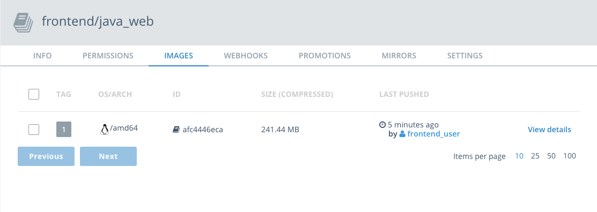

7. Next, build the MySQL database image. Change into the database directory.

```bash
	$ cd ../database
```

8. Use `docker build` to build your Docker image.

	```bash
	$ docker build -t $DTR_HOST/backend/database .
	```

9. Login in as `backend_user` and use `docker push` to upload your image up to Docker Trusted Registry.
	```bash
	$ docker push $DTR_HOST/backend/database
	```

10. In your web browser head back to your DTR server and click `View Details` next to your `database` repo to see the details of the repo.

11. Click on `Images` from the horizontal menu. Notice that your newly pushed image is now on your DTR.
images


### <a name="task2.4"></a> Task 2.4: Deploy the Web App using UCP

Docker lets me automate the process of building and running the application using a single file using Docker Compse. Compose is a tool for defining and running multi-container Docker applications. With Compose, you use a YAML file to configure your application’s services. Then, with a single command, you create and start all the services from your configuration.

I'll go through the Compose [file](./part_2/docker-compose.yml) 

```yaml
    version: "3.3"

    services:

      database:
        image: <$DTR_HOST>/backend/database
        # set default mysql root password, change as needed
        environment:
          MYSQL_ROOT_PASSWORD: mysql_password
        # Expose port 3306 to host. 
        ports:
          - "3306:3306" 
        networks:
          - back-tier
```

In the section above, I build the database container based on the Dockerfile in the `./database` directory which is also the Docker context or root directory for building the image. I can pass environmental variables such as the password and the port. I also name the image using the `image:` directive. 

```yaml
      webserver:
        image: <$DTR_HOST>/frontend/java_web
        ports:
          - "8080:8080" 
        networks:
          - front-tier
          - back-tier
```

In this section, I build the application in the `./appserver` directory and name the image `registration`. As in the database, I set the external ports.

```yaml
    networks:
      back-tier:
      front-tier:
```

In this section, I've defined two networks, the back-tier network isolates backend components from components on the front-tier network. This seems unnecessary in this current configuration but I'll make use of the networks in later iterations.

The next step is to run the app in Swarm. As a reminder, the application has two components, the web front-end and the database. In order to connect to the database, the application needs a password. If you were just running this in development you could easily pass the password around as a text file or an environment variable. But in production you would never do that. So instead, we're going to create an encrypted secret. That way access can be strictly controlled.

1. Go back to the first Play with Docker tab. Click on the UCP button. You'll have the same warnings regarding `https` that you have before. Click through those and log in. You'll see the Universal Control Panel dashboard.

2.  There's a lot here about managing the cluster. You can take a moment to explore around. When you're ready, click on `Swarm` and select `Secrets`.

	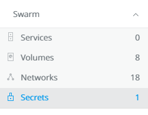

3. You'll see a `Create Secret` screen. Type `mysql_password` in `Name` and `Dockercon!!!` in `Content`. Then click `Create` in the lower left. Obviously you wouldn't use this password in a real production environment. You'll see the content box allows for quite a bit of content, you can actually create structured content here that will be encrypted with the secret.

	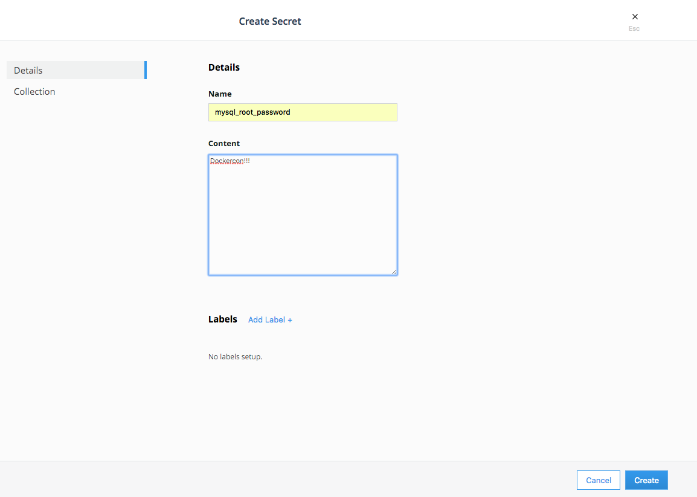

4. Next we're going to create two networks. First click on `Networks` under `Swarm` in the left panel, and select `Create Network` in the upper right. You'll see a `Create Network` screen. Name your first network `back-tier`. Leave everything else the default.

	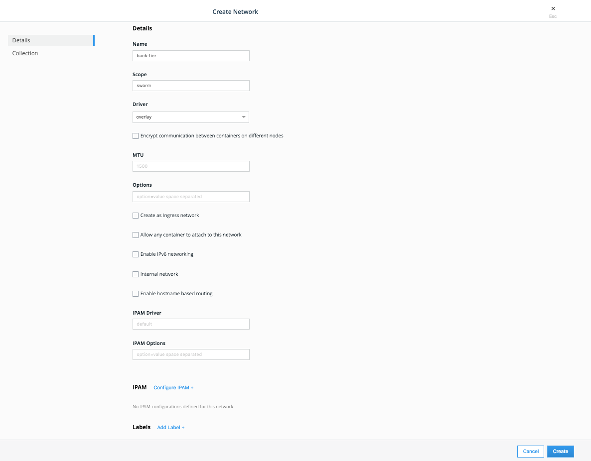

5. Repeat step 4 but with a new network `front-tier`.

6. Now we're going to use the fast way to create your application: `Stacks`. In the left panel, click `Shared Resources`, `Stacks` and then `Create Stack` in the upper right corner.

7. Name your stack `java_web` and select `Swarm Services` for your `Mode`. Below you'll see we've included a `.yml` file. Before you paste that in to the `Compose.yml` edit box, note that you'll need to make a quick change. Each of the images is defined as `<dtr hostname>/frontend/<something>`. You'll need to change the `<dtr hostname>` to the DTR Hostname found on the Play with Docker landing page for your session. It will look something like this:
`ip172-18-0-21-baeqqie02b4g00c9skk0.direct.ee-beta2.play-with-docker.com`
You can do that right in the edit box in `UCP` but wanted to make sure you saw that first.

	

	Here's the `Compose` file. Once you've copy and pasted it in, and made the changes, click `Create` in the lower right corner.

    ```yaml
    version: "3.3"

    services:

      database:
        image: <$DTR_HOST>/java/database
        # set default mysql root password, change as needed
        environment:
          MYSQL_ROOT_PASSWORD: mysql_password
        # Expose port 3306 to host. 
        ports:
          - "3306:3306" 
        networks:
          - back-tier

      webserver:
        image: <$DTR_HOST>/java/java_web:
        ports:
          - "8080:8080" 
        networks:
          - front-tier
          - back-tier

    networks:
      back-tier:
      front-tier:
        external: true 

    secrets:
      mysql_password:
        external: true
    ```

	Then click `Done` in the lower right.

8. Click on `Stacks` again, and select the `java_web` stack. Click on `Inspect Resources` and then select `Services`. Select `java_web_webserver`. In the right panel, you'll see `Published Endpoints`. Select the one with `:8080` at the end. You'll see a `Apache Tomcat/7.0.84` landing page. Add `/java-web` to the end of the URL and you'll see the app.

	

9. Delete the `java_web` stack.

## <a name="task3"></a>Task 3: Modernizing with Microservices

Now that I have stable build process, I can start migrating from a N-tier architecture to a service oriented architecture. I'll do this by picking features that can broken off into a services.

One of the problems associated with Java CRUD applications is that database operations can be expensive in terms of fetching and reading data from I/O and memory. Lots of users trying to write to a synchronous database can cause a bottleneck. One pattern to to make the application more efficient is to use a message queue. I can publish an event from the Web app to a message queue and move the data-persistence code into a new component that handles that event message. If I have a spike of traffic to the Web site I can run more containers on more hosts to cope with the incoming requests. Event messages will be held in the queue until the message handler consumes them.

 The message queue is implemented by adding a RESTful microservice that writes the user data to a Redis database that stores the information. If you’re not familiar with Redis, tt’s an in memory key-value store that’s great for saving abstract data types such as JSON lists. Note that I could use any other key-value datastore in place of Redis, such as memcached or MongoDB.

The [messageservice](./part_3/messageservice) uses the Spring Boot framework.  Spring Boot was chosen because it has many advantages such as handling the database connections transparently, implementing both a MVC architecture and RESTful interfaces is simple, and includes a built-in application server in the form of Tomcat. Another factor in choosing Spring Boot is that it has good support for Redis.  We could continue to use Spring as in the original application, but all of these advantages simplifies configuration and deployment.

The message service is an MVC application that uses the same User entity model in the original application. It consists of a repository for interacting with  Redis, a service that handles the connection and transport, and a controller for the REST endpoint.

The next piece is a [worker microservice](./part_3/worker) that retrieves the user data stored in Redis and writes the data to the application’s MySQL database. The worker is a Plain Old Java Object or POJO that pulls the data from Redis using the blpop method. This method allows the worker to to pop data from the queue without constantly checking the status of the queue. Blpop works like a one time trigger that fires when data gets placed in the queue. Setting up the communication between the application and the worker establishes a reliable and fast queuing system.

We’ll be adding three new components to the application - a Redis instance, the messageservice and the worker that writes to the database. There are Dockerfiles for both the [messageservice](./part_3/messageservice/Dockerfile) and the [worker](./part_3/worker/Dockerfile) to build them as images. Since Spring Boot includes Tomcat and the worker is just a jar file, I can build and deploy both components in a Java container.


## <a name="task3.1"></a>Task 3.1: Building the Microservices Images

1. Build the message service that writes to Redis.

```bash
$ cd ./part_3/messageservice
$ docker image build $DTR_HOST/backend/messageservice .
```

2. Build the worker service that reads from writes to MySQL.

```bash
$ cd ../part_3/worker
$ docker image build $DTR_HOST/backend/messageservice .
```

3. One last thing, I'll need to modify the code in the original application to send the user data from the form to messageservice instead of writing it to the database directly. The main change in the code is that the data is posted to the messageservice instead of MySQL. Note the URL, it uses the name of the messageservice defined in the Compose file.
Build the Java appserver.

```bash
$ cd ./part3/appserver
$ docker image build -t $DTR_HOST/backend/java_web:2 .
```

## <a name="task3.2"></a>Task 3.2: Push to DTR

1. Login as backend to DTR and push the messageservice and worker images.

```bash
	$ docker login $DTR_HOST
	Username: <your username>
	Password: <your password>
	Login Succeeded

	$ docker push $DTR_HOST/backend/messageservice
    $ docker push $DTR_HOST/backend/worker
```

2. Login as frontend to DTR and push the java_web:2 image.

```bash
	$ docker login $DTR_HOST
	Username: <your username>
	Password: <your password>
	Login Succeeded

	$ docker push $DTR_HOST/frontend/java_web:2
```

## <a name="task3.3"></a>Task 3.3: Run the Application in UPC

Adding all these new elements adds complexity to deployment and maintenance when compared to a monolithic application comprised of only a application server and a database. But we’ll use Docker to easily deploy, manage and maintain all these additional services. One component that's not in DTR is Redis, a Dockerfile is not needed because we'll use official Redis image without any additional configuration.

To run the application, create a new stack using this compose file:

```yaml
version: "3.3"

services:

  database:
    image: <$DTR_HOST>/backend/database
    environment:
      MYSQL_ROOT_PASSWORD: password
    ports:
      - "3306:3306" 
    networks:
      - back-tier

  webserver:
    image: <$DTR_HOST>/backend/java_web:2
    ports:
      - "8080:8080"
    environment:
      BASEURI: http://messageservice/users
    networks:
      - front-tier
      - back-tier

  messageservice:
    image: <$DTR_HOST>/backend/messageservice
    ports:
      - "8090:8090"
    networks: 
      - back-tier

  worker:
    image: <$DTR_HOST>/backend/worker
    networks: 
      - back-tier

  redis:
    image: redis
    container_name: redis
    ports: 
      - "6379:6379"
    networks:
      - back-tier

networks:
  front-tier:
  back-tier:
```

## <a name="task4"></a>Task 4: Iterating on the Client

Another benefit adding the messaging service is that it's now possible to update the client without having to rebuild the application. The original application used Java Server Pages for the client UI which is compiled along with the servlet. The message service let's me write another client in Javascript.

## <a name="task4.1"></a>Task 4.1: Building the Javascript Client


We'll use React.js along with Bootstrap to write the new client interface. React is a popular Javascript framework that has many built in features such as the calendar widget in the form fields. In addition, Bootstrap is a well known CSS library used for responsive web pages. One advantage is that updating the client no longer needs a Java developer and can be done by a front end developer. 

The client uses a Node.js container to build the javascript client and deployed it is to Nginx using a multi-stage build.

```
FROM node:latest AS build-deps
WORKDIR /usr/src/signup_client
COPY package.json yarn.lock ./
RUN yarn
COPY . ./
RUN yarn build

FROM nginx:alpine
COPY nginx.conf /etc/nginx/conf.d/default.conf
COPY --from=build-deps /usr/src/signup_client/build/ /usr/share/nginx/html
EXPOSE 80
CMD ["nginx", "-g", "daemon off;"]
```

1. Build the javascript client:

```bash
   $ cd ./part_4/signup_client
   $ docker image build -t $DTR_HOST/signup_client .
```

2. Push the javascript client to DTR:

```bash
   $ docker push $DTR_HOST/signup_client .
```
## <a name="task4.2"></a>Task 4.2: Deploying on a Running Cluster

1. One of the features of Docker Enterprise Edition is that we can add containers and functionality to a running cluster with no down time. Edit the existing stack file by copying the following

```bash
  signup_client:
    image:  <$DTR_HOST>/signup_client .
    ports:
      - "8000:80"
    networks: 
      - front-tier
```

[screen shots of updating the existing stack ]


2. I can sign up a new user with the client by browsing to the client `http://<UCP HOST>:8000/`


And login from the orginal client interface.

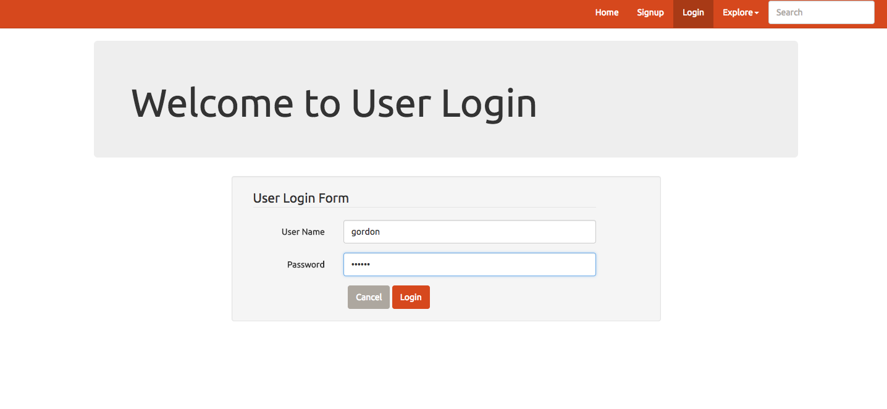


## <a name="task5"></a>Task 5: Adding Logging and Monitoring

One of the advantages of splitting out a feature into a separate service is that it makes it easier to add new features. We'll take advantage of the new service interface to implement logging and monitoring.

I'll implement Elasticsearch and Kibana to collect and visualize data from the application. To gather the data for the reporting database in Elasticsearch, I’ve added code to the worker that listens to events published by the web application. The analytics worker receives the data and saves it in Elasticsearch which is running in Docker container. I’ve chosen Elasticsearch because it can be clustered across multiple containers for redundancy and it has Kibana, which is an excellent front-end for analytics.

I’m not making changes to the application or the registration microservice, so I can just add new services for Elasticsearch and Kibana in the Docker Compose file. One of the features of Docker is that Docker Compose can incrementally upgrade an application. 

```
#logging
  elasticsearch:
    image: docker.elastic.co/elasticsearch/elasticsearch-oss:6.1.2
    container_name: elasticsearch
    ports:
      - "9200:9200"
      - "9300:9300"
    environment:
      ES_JAVA_OPTS: "-Xmx256m -Xms256m"
    networks: 
      - elk

  kibana:
    image: docker.elastic.co/kibana/kibana-oss:6.1.2
    container_name: kibana
    ports:
      - "5601:5601"
    networks: 
      - elk
    depends_on:
      - elasticsearch
```
### <a name="task5.1"></a>Task 5.1: Add Data
It won’t replace running containers if their definition matches the service in the Docker Compose file. Since the worker service has been updated docker-compose up -d will run the containers for the Elasticsearch, Kibana and the message handler. It will leave the other containers running as is,letting me add new features without taking the application offline.

To run the example:
```
$ docker-compose up -d
```


To make the example more visually interesting, I added code to calculate the age of the person based on their birthday and write that to Elasticsearch. To test it out, I wrote a small shell script that posts the user data to the service to populate the database.
```
$ ./firefly_data.sh
```

### <a name=task5.2></a>Task 5.2: Display Data on Kibana
Now, I can use Kibana to index the data and look at the data.

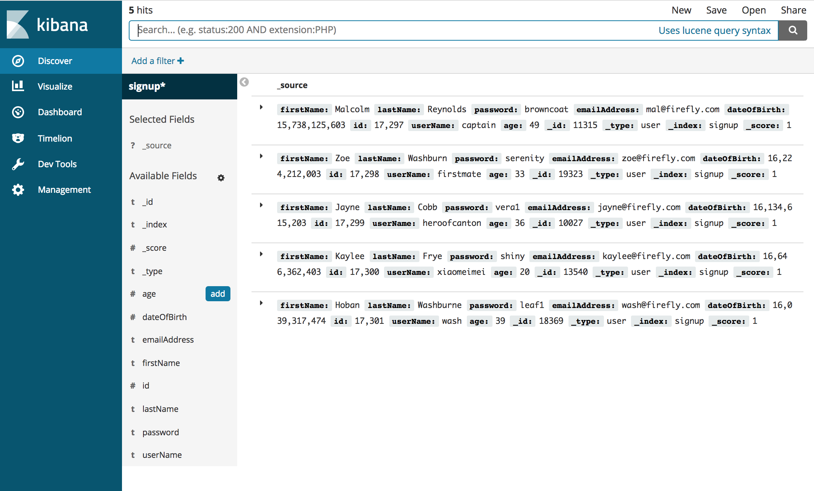

I can then make a chart of the character's ages using a Kibana visualization.

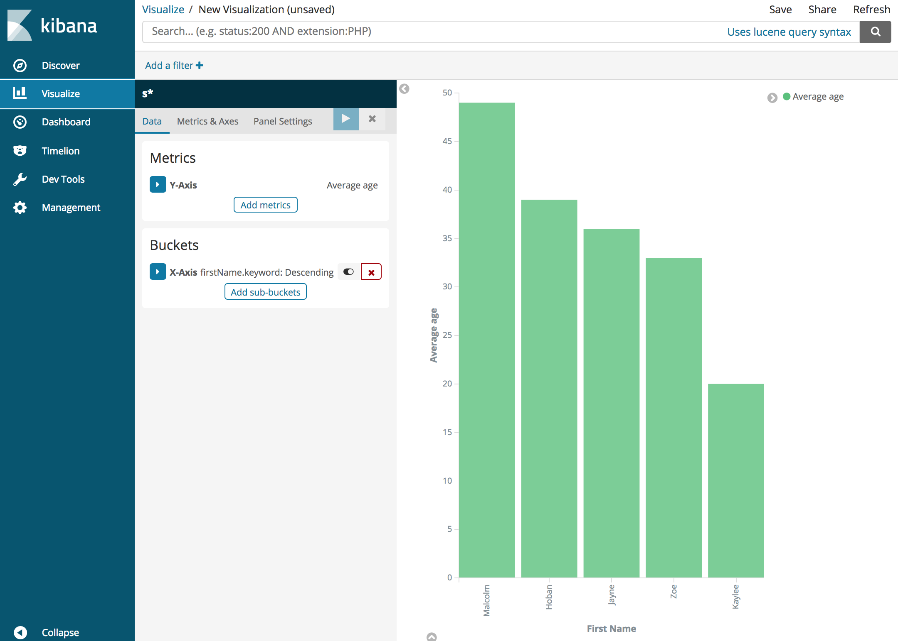


## <a name="task6"></a>Task 6: Deploying in Kubernetes

Docker EE gives you the choice of which orchestrator that you want to choose. The same application that you deployed in Docker Swarm can be deployed in Kubernetes using a Docker Compose file or with Kubernetes manifests.

### <a name="task6.1></a>Task 6.1: Delete the Stack

Delete the application stack you deployed in Docker Swarm


### <a name="task6.1></a>Task 6.1: Deploy Application in Kubernetes with a Compose File

Deploy the application in Kubernetes using a Docker Compose file. 


Copy the Compose file below to deploy the application.

```yaml
# Compose file modified to deploy using Kubernets
```

###  <a name="task6.2></a>Task 6.2: Check out the Deployment on the Command Line

1. Go to the terminal window.

2. View all info on deployment:

```bash
$ kubectl get all
```

3. View info on pods

```bash
$ kubectl get pods
```

4. View info on loadbalancers

```bash
$ kubectl get lbs
```

... yatta yatta yatta


###  <a name="task6.3></a>Task 6.3: Check out the Deployment using UCP

1. View pods

2. View services

3. View loadbalancers

...  yatta yatta yatta

## Conclusion

### What we covered

### Modernization Workflow

### Agility

### Choice

## Call to Action

### Download Docker EE
### MTA
### Docker Associate Certification